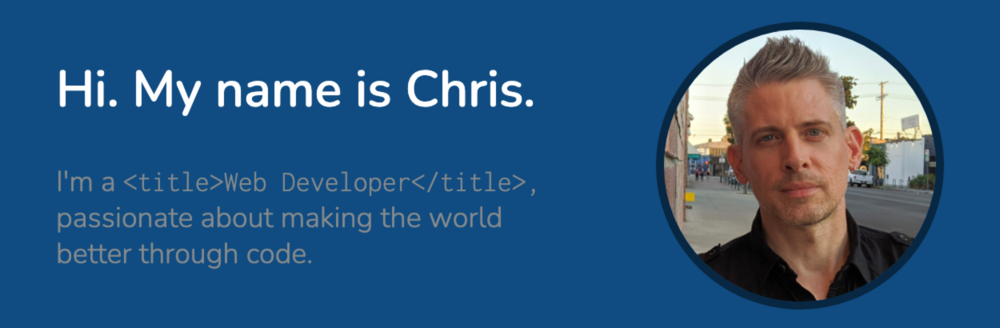

# Dev Portfolio, MERN-style

## Project Overview

**Dev Portfolio** is a simple MERN app for showcasing my work as a FSWD (full-stack web developer). The landing page highlights the six projects pinned on [my GitHub profile](https://github.com/icn2you). A basic contact form is available for visitors to send me a message. Visitors can also discover a bit about me via my biosketch at the bottom. From the landing page, visitors can link to the portfolio page, which exhibits all of my recent projects.

In its [original release](https://icn2you.com/fsf-portfolio/), my developer portfolio was a static web page. After becoming enchanted with React in [The Coding Bootcamp @ UCLA Extension](https://bootcamp.uclaextension.edu/coding/online/landing/), I opted to refactor it into a SPA (single-page application) employing the [MERN stack](https://medium.com/@blockchain_simplified/what-is-mern-stack-9c867dbad302). After deployment, I saw the opportunity to improve upon it further, refactoring it into two distinct components, specifically the home page and the portfolio page. My developer portfolio is fully reponsive in modern web browsers. In the near future, I intend to add a blog.

## Core Technologies

## To-do List

- [ ] Launch developer blog

## Release History

|Version|Description                       |
|-------|----------------------------------|
|1.0    |static web page                   |
|2.0    |SPA using MERN stack              |
|2.1    |home page and portfolio components|
